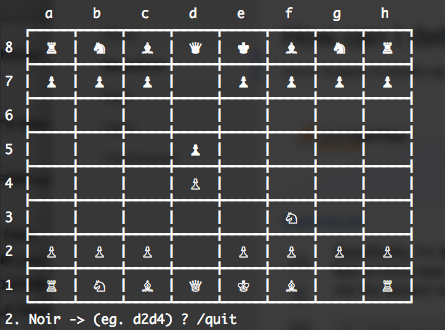

# Chess Game - User Manual

This guide explains how to interact with the Chess engine.

## Basic Commands

The game operates in a command-line loop. You enter moves or special commands at the prompt.

### Interface Explanation
As shown in the image above:
- The **Board** is displayed with a grid structure.
- **Coordinates** (a-h and 1-8) are clearly marked.
- The **Prompt** (e.g., `2. Black -> (eg. d2d4) ?`) indicates:
  - The current move number.
  - The player whose turn it is.
  - An example of the expected move format.

## Basic Commands

- **Move a piece**: Enter the starting and ending coordinates without spaces.
  - Example: `e2e4` moves the piece at e2 to e4.
  - Example: `b1c3` moves the knight from b1 to c3.
- **Castle kingside**: Enter `O-O`, `o-o`, `0-0`, or the coordinate move `e1g1` / `e8g8`.
- **Castle queenside**: Enter `O-O-O`, `o-o-o`, `0-0-0`, or the coordinate move `e1c1` / `e8c8`.
- **`/quit`**: Exits the game immediately and prints the final board state.
- **`/resign`**: Forfeit the game.
- **`/draw`**: Offer or accept a draw.

## Board Coordinate System

The board uses standard algebraic notation:
- **Columns**: `a` to `h` (from left to right).
- **Rows**: `1` to `8` (from White's side to Black's side).

## Piece Symbols

The board uses high-visibility ASCII representations for compatibility:

| Symbol | Piece | Color |
| :---: | :--- | :--- |
| `wP` | Pawn | White |
| `wR` | Rook | White |
| `wN` | Knight | White |
| `wB` | Bishop | White |
| `wQ` | Queen | White |
| `wK` | King | White |
| `bP` | Pawn | Black |
| `bR` | Rook | Black |
| `bN` | Knight | Black |
| `bB` | Bishop | Black |
| `bQ` | Queen | Black |
| `bK` | King | Black |

## Gameplay Flow

1. **White moves first**.
2. **Turn Prompt**: The game shows the turn number and active color, e.g., `1. White -> (eg. d2d4) ?`.
3. If a move is illegal, a relevant error message is displayed.
4. If you put the opponent's King in check, a notification appears.
5. The game ends automatically upon Checkmate or Stalemate.
